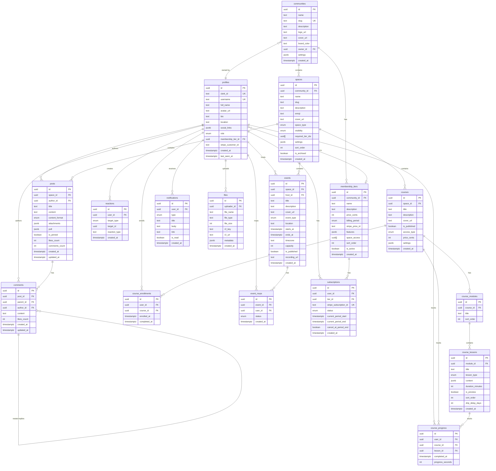

# OpenCircle Database Schema Diagram

This document provides a visual overview of the OpenCircle database schema.

## Entity Relationship Diagram



## Table Relationships Summary

### Core Hierarchy
- **Community** → **Spaces** → **Posts** → **Comments**
- **Community** → **Membership Tiers** → **Profiles**
- **Spaces** can be: Discussion, Chat, Course, Events, or Resources

### User-Generated Content
- **Profiles** create **Posts** and **Comments**
- **Profiles** add **Reactions** to Posts/Comments
- **Profiles** upload **Files** to R2 storage

### Course System
- **Courses** → **Modules** → **Lessons**
- **Profiles** have **Enrollments** and **Progress** per Course

### Events System
- **Events** belong to **Spaces**
- **Profiles** create **RSVPs** for Events

### Monetization
- **Profiles** have **Subscriptions** to **Membership Tiers**
- **Membership Tiers** grant access to **Spaces** (via `required_tier_ids`)

### Notifications
- **Profiles** receive **Notifications** for various actions

## Schema Design Principles

### 1. Multi-Tenancy Ready
- All entities connect to a `community_id`
- Supports multiple communities in one database
- Can easily filter by community for data isolation

### 2. Type Safety
- Extensive use of PostgreSQL enums
- JSONB fields for flexible, typed data
- TypeScript types generated from schema

### 3. Soft Deletes
- `is_archived` flags instead of hard deletes where appropriate
- Preserves data integrity and allows recovery

### 4. Audit Trail
- `created_at` timestamps on all tables
- `updated_at` on content tables (posts, comments)
- `last_seen_at` for user activity tracking

### 5. Performance Optimizations
- Denormalized counts (`likes_count`, `comments_count`)
- Updated via optimistic updates in application code
- Indexed foreign keys and common query patterns

### 6. Flexible Content
- JSONB for attachments, polls, settings
- Rich content types for course lessons
- Extensible without schema changes

## Key Design Decisions

### Why No Chat Tables?
- Chat/DMs handled by **Waku** (peer-to-peer protocol)
- No message persistence needed
- Reduces database load and storage costs
- Real-time performance through P2P

### Why Clerk for Auth?
- No auth tables needed - Clerk handles it
- Profiles synced via webhooks on user creation
- `clerk_id` links Clerk user to profile
- Simplified security model

### Why Cloudflare R2?
- Files table stores **metadata only**
- Actual bytes stored in R2 (S3-compatible)
- Cheaper than traditional storage
- Better performance with CDN

### Why Drizzle ORM?
- Type-safe queries with full IntelliSense
- Zero runtime overhead
- Excellent TypeScript integration
- Modern, lightweight alternative to Prisma
- Better control over SQL generation

## Enums Reference

### role
- `member` - Standard community member
- `moderator` - Can moderate content
- `admin` - Can manage spaces and members
- `owner` - Full community control

### space_type
- `discussion` - Threaded posts and comments
- `chat` - Real-time messaging (Waku)
- `course` - Structured learning content
- `events` - Calendar and event management
- `resources` - File library/links

### visibility
- `public` - All members can access
- `private` - Invite only
- `paid` - Requires specific tier

### billing_period
- `monthly` - Charged monthly
- `yearly` - Charged annually
- `lifetime` - One-time payment

### lesson_type
- `video` - Video content
- `text` - Rich text/markdown
- `audio` - Audio file
- `download` - Downloadable resource
- `quiz` - Multiple choice quiz
- `assignment` - Submitted work

### notification_type
- `mention` - @mentioned in post/comment
- `reply` - Reply to your content
- `event_reminder` - Event starting soon
- `course_unlocked` - New lesson available
- `membership_renewal` - Subscription renewing
- `new_post` - New post in followed space
- `new_follower` - Someone followed you

## Indexes Recommendation

For production, add these indexes:

```sql
-- Profiles
CREATE INDEX idx_profiles_clerk_id ON profiles(clerk_id);
CREATE INDEX idx_profiles_username ON profiles(username);
CREATE INDEX idx_profiles_membership_tier_id ON profiles(membership_tier_id);

-- Spaces
CREATE INDEX idx_spaces_community_id ON spaces(community_id);
CREATE INDEX idx_spaces_slug ON spaces(slug);
CREATE INDEX idx_spaces_type ON spaces(space_type);

-- Posts
CREATE INDEX idx_posts_space_id ON posts(space_id);
CREATE INDEX idx_posts_author_id ON posts(author_id);
CREATE INDEX idx_posts_created_at ON posts(created_at DESC);
CREATE INDEX idx_posts_pinned ON posts(is_pinned, created_at DESC);

-- Comments
CREATE INDEX idx_comments_post_id ON comments(post_id);
CREATE INDEX idx_comments_parent_id ON comments(parent_id);
CREATE INDEX idx_comments_author_id ON comments(author_id);

-- Reactions
CREATE INDEX idx_reactions_target ON reactions(target_type, target_id);
CREATE INDEX idx_reactions_user_id ON reactions(user_id);

-- Courses
CREATE INDEX idx_courses_space_id ON courses(space_id);
CREATE INDEX idx_course_modules_course_id ON course_modules(course_id);
CREATE INDEX idx_course_lessons_module_id ON course_lessons(module_id);

-- Course Progress
CREATE INDEX idx_course_progress_user_id ON course_progress(user_id);
CREATE INDEX idx_course_progress_course_id ON course_progress(course_id);
CREATE INDEX idx_course_enrollments_user_id ON course_enrollments(user_id);

-- Events
CREATE INDEX idx_events_space_id ON events(space_id);
CREATE INDEX idx_events_starts_at ON events(starts_at);
CREATE INDEX idx_event_rsvps_event_id ON event_rsvps(event_id);
CREATE INDEX idx_event_rsvps_user_id ON event_rsvps(user_id);

-- Notifications
CREATE INDEX idx_notifications_user_id_read ON notifications(user_id, is_read);
CREATE INDEX idx_notifications_created_at ON notifications(created_at DESC);

-- Subscriptions
CREATE INDEX idx_subscriptions_user_id ON subscriptions(user_id);
CREATE INDEX idx_subscriptions_stripe_id ON subscriptions(stripe_subscription_id);

-- Files
CREATE INDEX idx_files_uploader_id ON files(uploader_id);
CREATE INDEX idx_files_r2_key ON files(r2_key);
```

## Constraints Summary

### Unique Constraints
- `communities.slug` - URL-friendly identifier
- `profiles.clerk_id` - Clerk user mapping
- `profiles.username` - User handle
- `reactions(user_id, target_type, target_id, reaction_type)` - One reaction per user per target
- `course_progress(user_id, lesson_id)` - One progress record per lesson
- `course_enrollments(user_id, course_id)` - One enrollment per course
- `event_rsvps(event_id, user_id)` - One RSVP per event
- `subscriptions.stripe_subscription_id` - Stripe sync

### Foreign Key Cascades
- **CASCADE** on most references - deleting parent deletes children
- Protects referential integrity
- Examples:
  - Deleting a community deletes all its spaces
  - Deleting a space deletes all its posts
  - Deleting a post deletes all its comments

### Check Constraints (not in schema yet, but recommended)
```sql
ALTER TABLE membership_tiers ADD CONSTRAINT price_non_negative
  CHECK (price_cents >= 0);

ALTER TABLE events ADD CONSTRAINT valid_time_range
  CHECK (ends_at IS NULL OR ends_at > starts_at);

ALTER TABLE events ADD CONSTRAINT valid_capacity
  CHECK (capacity IS NULL OR capacity > 0);
```
